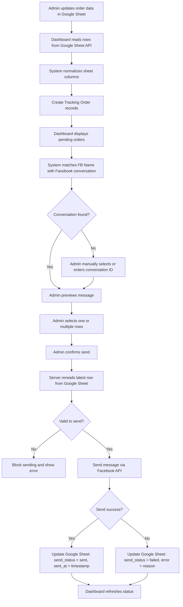
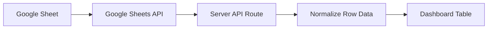
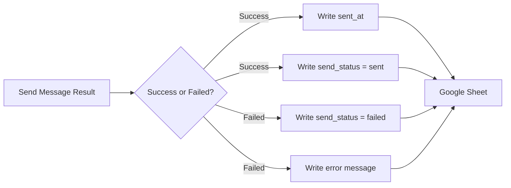
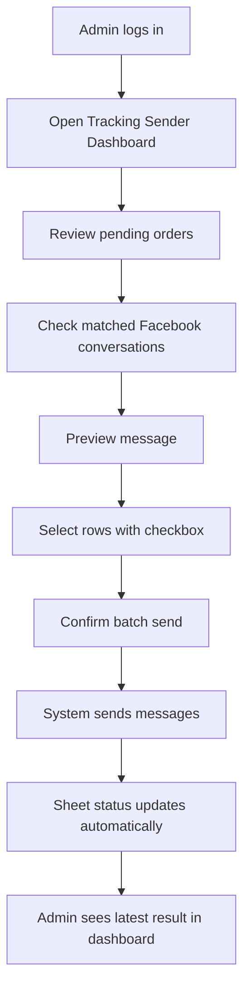
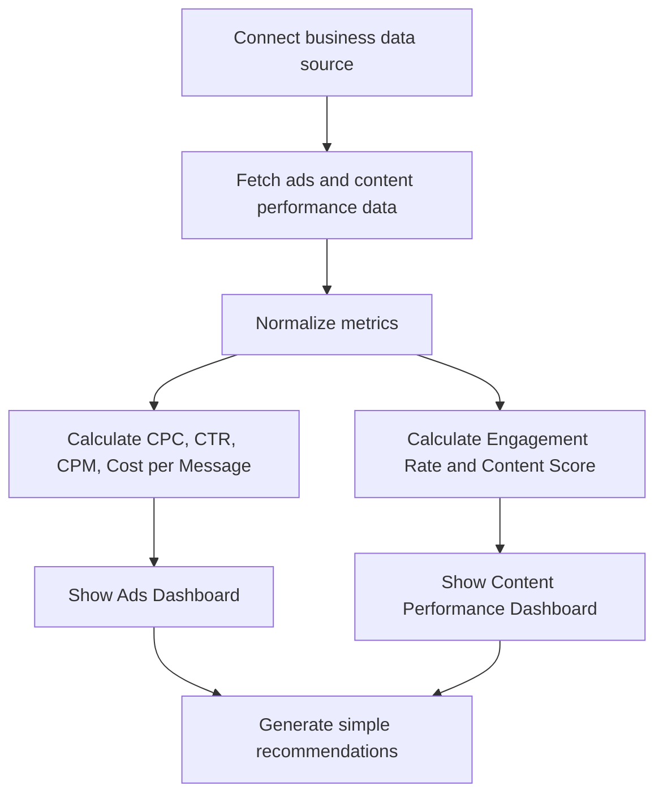

# E-commerce Operations & Analytics Dashboard

## Project Summary

โปรเจกต์นี้เป็นเว็บ Dashboard สำหรับช่วยผู้ประกอบการร้านค้าออนไลน์จัดการงานหลังบ้านและดูภาพรวมผลลัพธ์ทางการตลาดในที่เดียว ระบบถูกออกแบบให้ใช้งานง่ายผ่าน Browser โดยมี 2 ส่วนหลัก:

1. ระบบส่งเลขพัสดุให้ลูกค้าอัตโนมัติ
2. Dashboard วิเคราะห์ข้อมูลหลังบ้านและประสิทธิภาพคอนเทนต์/โฆษณา

ระบบใช้ Google Sheet เป็นฐานข้อมูลหลักสำหรับงานส่งเลขพัสดุ และเชื่อมต่อ Facebook API เพื่อค้นหาลูกค้าในแชทและส่งข้อความแจ้งเลขพัสดุแบบอัตโนมัติ

## Main Goals

- ลดเวลาการส่งเลขพัสดุให้ลูกค้าทีละคน
- ลดความผิดพลาดจากการคัดลอกข้อความเอง
- ช่วยให้เจ้าของร้านเห็นสถานะการส่งข้อความแบบชัดเจน
- รวมข้อมูลหลังบ้านและข้อมูลการตลาดให้ดูง่ายขึ้น
- ช่วยตัดสินใจว่าโพสต์หรือแคมเปญใดควรนำไปต่อยอด

## Key Features

### 1. Tracking Sender Dashboard

ระบบนี้ใช้สำหรับส่งข้อความแจ้งเลขพัสดุให้ลูกค้าผ่านช่องทางแชท

ฟีเจอร์หลัก:

- ดึงข้อมูลลูกค้าจาก Google Sheet
- รองรับข้อมูล เช่น ชื่อ Facebook, เลขพัสดุ, ชื่อลูกค้า, ยอดปลายทาง และข้อความที่ต้องส่ง
- แสดงรายการลูกค้าทั้งหมดใน Dashboard
- ค้นหาลูกค้าจากชื่อหรือข้อมูลในตาราง
- Preview ข้อความก่อนส่ง
- จับคู่ลูกค้ากับ Facebook Conversation
- รองรับการเลือกหลายรายการด้วย Checkbox
- ส่งข้อความแบบ Batch ได้หลายรายการพร้อมกัน
- ป้องกันการส่งซ้ำ
- บันทึกสถานะการส่งกลับไปยัง Google Sheet

### 2. Social Commerce Intelligence Dashboard

ระบบนี้ใช้สำหรับดูภาพรวมผลลัพธ์ของร้านค้าออนไลน์

ฟีเจอร์หลัก:

- แสดงยอดใช้เงินโฆษณา
- แสดงจำนวนลูกค้าที่ทักเข้ามา
- คำนวณต้นทุนต่อแชท
- วิเคราะห์ Campaign Performance
- วิเคราะห์ Post Performance
- แสดง Engagement Rate
- จัดอันดับโพสต์ที่ทำผลงานดี
- แนะนำโพสต์ที่ควรนำไปต่อยอดหรือ Boost
- แสดงรายละเอียดโพสต์พร้อมรูป Thumbnail, ยอดเข้าถึง, ยอดคลิก, แชร์, คอมเมนต์ และ Engagement

## Google Sheet Structure

Google Sheet ถูกใช้เป็นฐานข้อมูลหลักของระบบส่งเลขพัสดุ โดยผู้ดูแลสามารถแก้ไขข้อมูลได้ง่ายจาก Sheet เดิมของร้าน

ตัวอย่างคอลัมน์หลัก:

| Column | Field | Description |
|---|---|---|
| A | FB Name | ชื่อ Facebook ของลูกค้า ใช้สำหรับจับคู่กับแชท |
| B | เลขพัสดุ | Tracking Number |
| C | Name | ชื่อผู้รับสินค้า |
| D | ยอดปลายทาง | ยอดเก็บเงินปลายทาง หรือ 0 ถ้าโอนแล้ว |
| E | สรุป | ข้อความที่ต้องส่งให้ลูกค้า |

คอลัมน์สถานะที่ระบบสามารถบันทึกกลับได้:

| Field | Description |
|---|---|
| conversation_id | ID ของห้องแชทลูกค้า |
| send_status | สถานะการส่ง เช่น pending, sent, failed |
| sent_at | เวลาที่ส่งสำเร็จ |
| error | ข้อความ error กรณีส่งไม่สำเร็จ |

## Data Flow: Google Sheet to Customer Message



## Google Sheet Save Flow

ระบบไม่ได้ใช้ฐานข้อมูลแยกในรอบ MVP แต่ใช้ Google Sheet เป็น Source of Truth โดยทุกสถานะสำคัญจะถูกเขียนกลับไปที่ Sheet

### Read Flow



### Write Flow



## Safety Logic

ระบบมีการป้องกันความผิดพลาดก่อนส่งข้อความจริง

- ต้องมีข้อความก่อนส่ง
- ต้องมีเลขห้องแชทหรือ conversation ID
- ต้องมีสถานะจับคู่ลูกค้าสำเร็จ
- ถ้าแถวถูกส่งแล้ว ระบบจะไม่ส่งซ้ำ
- ก่อนส่งจริง Server จะอ่านข้อมูลจาก Google Sheet อีกครั้ง เพื่อให้ใช้ข้อมูลล่าสุด
- หากส่งไม่สำเร็จ ระบบจะบันทึก error กลับไปยัง Sheet
- API keys และข้อมูลลับถูกเก็บไว้ฝั่ง Server เท่านั้น

## User Flow



## Analytics Flow



## Tech Stack

- Next.js
- React
- TypeScript
- Tailwind CSS
- Google Sheets API
- Facebook API
- REST API
- Vitest
- Vercel
- GitHub

## Deployment

ระบบถูก deploy ขึ้น Production ผ่าน Vercel และเชื่อม source code กับ GitHub เพื่อให้สามารถพัฒนาและอัปเดตต่อได้

Production URL:

```text
https://tracking-sender-dashboard.vercel.app
```

GitHub Repository:

```text
https://github.com/maewannaofficial/Tracking-Sender
```

## Resume Summary

Built an e-commerce operations dashboard for online sellers to manage parcel notification workflows and business performance insights. The system integrates Google Sheets as the operational data source, automates tracking-number messages to customers through Facebook conversations, supports batch sending with duplicate protection, and provides analytics dashboards for ads and content performance.

